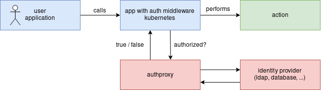

# authproxy

**A Kubernetes compatible webhook authentication proxy framework and clientset.**

<p align="center">
    
</p>

[](https://github.com/cbrgm/authproxy/blob/master/LICENSE)
[](https://goreportcard.com/report/github.com/cbrgm/authproxy)

## What is it for?

authproxy is a framework that allows to build middleware in order to authenticate users and applications against different identity providers.
It is built for use with Kubernetes in mind and supports its token and auhorizations webhook modes but it can also be used standalone.

authproxy offers endpoints for issuing bearer tokens and validating them.
The concrete behavior of the endpoints is determined by an implementation for a specific backend, a so-called identity provider.

An identity provider only has to implement the [provider interface](https://github.com/cbrgm/authproxy/blob/master/provider/provider.go) specification and authproxy takes care of handling requests, marshalling data types, managing encryption and allowing you to focus on your provider implementation.

## TL;DR

* Full-featured, Kubernetes compatible authentication middleware framework
    * Highly configurable due to plugable identity provider implementations
    * Integrates with Kubernetes apiserver webhook mode
    * Supports mutual TLS, Prometheus Metrics, Log Levels, ...
* Client for easy implementation of authentication mechanisms for applications
* Lightweight, extensible, and built with developer UX in mind

## Authproxy API Endpoints

| Endpoints       | Type     | Description                                                            |
|-----------------|----------|------------------------------------------------------------------------|
| v1/login        | public   | Issues bearer tokens for clients                                       |
| v1/authenticate | public   | Validates bearer tokens and provides authentication                    |
| /metrics        | internal | Provides metrics to be observed by Prometheus                          |
| /healthz         | internal | Indicates wether authproxy is healthy or not (for use with Kubernetes) |

## Configuration

| Options         | Description                                                                          |
|-----------------|--------------------------------------------------------------------------------------|
| HTTPAddr        | The address the proxy runs on (default: ":6660")                                     |
| HTTPPrivateAddr | The address authproxy runs a http server only for internal access (default: ":6661") |
| TLSKey          | The tls key file to be used                                                          |
| TLSCert         | The tls cert file to be used                                                         |
| TLSClientCA     | The tls client ca file to be used                                                    |
| LogJSON         | The logger will log json lines                                                       |
| LogLevel        | The log level to filter logs with before printing (default: "info")                  |

## Custom Provider Implementation

The following explains how to implement your own identity provider using authproxy.

### Building a custom identity provider implementation

Your provider must implement the following interface:

***Provider Interface***:
```go
type Provider interface {
	Login(username, password string) (*models.TokenReviewRequest, error)
	Authenticate(bearerToken string) (*models.TokenReviewRequest, error)
}
```

Here is an example of a fake provider, that creates a BearerToken for the user `foo` with password `bar` and can validate it.
This serves only as inspiration. Of course you can easily implement other providers like database queries or third party services.

***mock.go (Example Provider)***:
```go
type Mock struct {
	Name string
}

func NewMockProvider() *Mock {
	return &Mock{
		Name: "mock-authenticator",
	}
}

func (provider *Mock) Login(username, password string) (*models.TokenReviewRequest, error) {
	var isAuthenticated = false
	var bearerToken = ""

	if username == "foo" && password == "bar" {
		isAuthenticated = true

		// generate bearerToken to be used for authentication
		bearerToken = "AbCdEf123456"
	}

	return &models.TokenReviewRequest{
		APIVersion: "authentication.k8s.io/v1beta1",
		Kind:       "TokenReview",
		Status: &models.TokenReviewStatus{
			// Required: let the client know if the user has successfully authenticated
			Authenticated: isAuthenticated,

			// optional: add user information for the client
			User: &models.UserInfo{
				Username: username,
				UID:      "1",
				Groups:   []string{"developers"},
			},
		},
		// Required: return the token for the client
		Spec: &models.TokenReviewSpec{
			Token: bearerToken,
		},
	}, nil
}

func (provider *Mock) Authenticate(bearerToken string) (*models.TokenReviewRequest, error) {
	var isTokenValid = false

	if bearerToken == "AbCdEf123456" {
		isTokenValid = true
	}

	return &models.TokenReviewRequest{
		APIVersion: "authentication.k8s.io/v1beta1",
		Kind:       "TokenReview",
		// Required: let the client know that the token is valid or not
		Status: &models.TokenReviewStatus{
			Authenticated: isTokenValid,
		},
	}, nil
}
```

### Use authproxy with your provider implementation

Start the authproxy with the fake provider:

***main.go***
```go
package main

import (
	"fmt"
	"github.com/cbrgm/authproxy/authproxy"
	"github.com/cbrgm/authproxy/provider/mock"
)

func main() {
  // create the config from command line flags
  config := authproxy.ProxyConfig{
  	HTTPAddr:         ":6660",
  	HTTPPrivateAddr:  ":6661",
  	TLSKey:           "./server.key",
  	TLSCert:          "./server.crt",
  	TLSClientCA:      "./ca.crt",
  	LogJSON:          false,
  	LogLevel:         "info",
  }

  // initialize the identity provider
  fake := mock.NewMockProvider()

  // add the provider and config to the proxy
  prx := authproxy.NewWithProvider(fake, config)

  if err := prx.ListenAndServe(); err != nil {
      fmt.Printf("something went wrong: %s", err)
      os.Exit(1)
  }
  return nil
}
```
### Client usage for implementing app authentication

authproxy provides a client to communicate with the API. It can be used to build authentication mechanisms into apps.
The use is kept very simple:

***client.go***
```go
package main

import (
	"fmt"
	"github.com/cbrgm/authproxy/client"
)

func main() {
  username, password := "foo", "bar"

  cfg := client.AuthClientConfig{
  	TLSKey:      "./client.key",
  	TLSCert:     "./client.crt",
  	TLSClientCA: "./ca.crt",
  }

  cl, err := client.NewForConfig(&cfg)
  if err != nil {
  	return
  }

  // receive a bearer token
  token, err := cl.V1.Login(username, password)
  if err != nil {
  	return
  }

  // authenticate the bearer token
  ok, err := cl.V1.Authenticate(token)
  if err != nil {
  	return
  }

  if !ok {
  	fmt.Println("client unauthenticated, token is invalid")
  	return
  }

  fmt.Println("client successfully authenticated, token is valid")
}

```

## Kubernetes and authproxy

When a client attempts to authenticate with the API server using a bearer token, the apiservers authentication webhook POSTs a JSON-serialized authentication.k8s.io/v1beta1 TokenReview object containing the token to authproxy.

In order to use authproxy as a service for Kubernetes Webhook Token Authentication, you must configure the api server according to the documentation [here](./docs/deploy_kubernetes.md).

## Projects using authproxy

* LDAP / Active Directory: [cbrgm/authproxy-ldap](https://github.com/cbrgm/authproxy-ldap])
## Credit & License

authproxy is open-source and is developed under the terms of the [Apache 2.0 License](https://github.com/cbrgm/authproxy/blob/master/LICENSE).

Maintainer of this repository is:

-   [@cbrgm](https://github.com/cbrgm) | Christian Bargmann <mailto:chris@cbrgm.net>

Please refer to the git commit log for a complete list of contributors.

## Contributing

See the [Contributing Guide](https://github.com/cbrgm/authproxy/blob/master/CONTRIBUTING.md).
